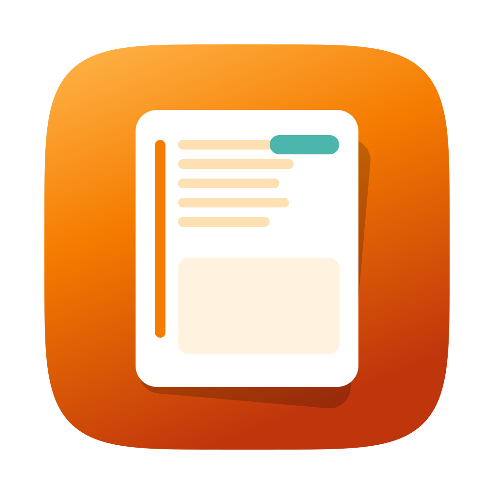

<div align="center">



# Quiet Clipboard

**Every copy. Always there. Never in the way.**

A native macOS clipboard history manager that silently captures everything you copy — text, images, links, files, code, colors, screenshots — and keeps it all searchable in a fast, private local library. Part of the [Quiet Apps](https://github.com/quietapps) family.

[](https://www.apple.com/macos/)
[](https://swift.org)
[](https://developer.apple.com/xcode/swiftui/)
[](LICENSE)
[](https://github.com/quietapps/QuietClipboard/releases)
[](https://github.com/quietapps/QuietClipboard/releases)
[](https://github.com/quietapps/QuietClipboard/stargazers)

[Install](#install) · [Features](#features) · [Usage](#usage) · [Build from source](#build-from-source) · [FAQ](#faq)

</div>

---

## Why

You copied something twenty minutes ago. You need it now. It's gone.

Quiet Clipboard runs silently in your menu bar and captures every copy you make. Hit `Ctrl+Cmd+V` to open a Spotlight-style search over your entire clipboard history — text, images, links, files, code snippets, hex colors, screenshots — and paste anything back instantly. Everything stays on your machine. No cloud. No account. No telemetry.

## Features

**Current release (Xcode):** version **0.2.4**, build **1** — see [CHANGELOG](CHANGELOG.md) for per-build notes

### Capture & history

- **Clipboard history** — captures text, rich text, Markdown, images, screenshots, links, files, code, colors, and SVGs automatically as you copy
- **Copy events** — each paste-back and re-copy is tracked; items show copy count, “copied N× today,” and expandable copy history
- **Near-duplicate grouping** — similar clips collapse in the library; **Show N similar** opens siblings with a dedicated thumbnail card
- **Universal Clipboard** — Handoff copies from iPhone/iPad detected and tagged; optional capture in Settings
- **Pause capture** — suppress capture from the menu bar or Settings; icon shows paused state

### Search & paste

- **Quick search overlay** — `Ctrl+Cmd+V` Spotlight-style panel; grid/list; optional preview pane; placement at cursor, menu icon, screen center, and more
- **Fuzzy ranked search** — typo-tolerant, on-device; ranks by relevance, recency, and type; debounced for responsive typing
- **Pinned clips** — ten permanent slots; **Pinned** filter + slot shelf in Quick Search; `Ctrl+Option+Cmd+1–0` paste slots; **⌥P** / **⌥F** / **⌥D** on selection
- **Paste into prior app** — remembers the focused app before the panel opened
- **Keyboard shortcuts** — remappable actions; `Ctrl+Cmd+0–9` pastes recent clips 1–10 (by recency, not pinned)

### Library & menu bar

- **Full library** — `Ctrl+Cmd+L`; grid, list, or **timeline**; group by type, app, or day; sort including **last copied**; **Pinned** sidebar for slot assignment
- **Menu bar popover** — last clips with grid/list toggle, search, favorites, delete, Open Library
- **Notch shelf / Dynamic Island** — `Ctrl+Cmd+N`; drag clips into any app
- **Preview density** — compact text rows or rich thumbnails (Settings → General)

### Rich previews

- **Code highlighting** — language detection and syntax-colored previews
- **Color swatches** — hex, rgb, hsl, named CSS; copy any format from detail
- **Link previews & favicons** — `LPMetadataProvider` cards plus domain favicons on rows
- **Markdown / RTF** — rendered previews; export `.md` / `.rtf`; styled HTML/RTFD from apps (badges, pills) captured and pasted back faithfully when plain text is empty
- **OCR** — Vision text extraction on images; searchable
- **Structured data badges** — email, phone, UUID, ISO date, IBAN, IP, semver; copy normalized value or create local Reminder/Contact

### Organization & privacy

- **Favorites, pins & categories** — favorites (stars); ten pinned slots (separate from favorites); custom categories with icons/colors; auto category suggestions
- **Sensitive content** — on-device detection; don’t save, **save but hide** (blur until Reveal), or save normally
- **Retention & storage** — auto-delete by age; manual cleanup; disk usage and JSON backup in **Settings → Storage**
- **Usage statistics** — **Settings → Statistics**: copies/day, top apps, types, busiest hours (on-device)
- **Settings** — top tab bar and Library-matched black chrome; fixed-width window; **Statistics** split from Storage; footer **Library** + **Quit**
- **Excluded apps** — ignore copies while a chosen app is frontmost; **Recommended** list; first launch excludes 1Password and Keychain Access by default
- **Export / Import** — JSON backup with metadata
- **WidgetKit widgets** — Small, Medium, Large with AppIntents
- **Privacy first** — offline; no analytics; optional link previews only network call; data in `~/Library/Application Support/QuietClipboard/`

## Install

> **Note:** Quiet Clipboard is not code-signed with an Apple Developer ID. macOS Gatekeeper will warn on first launch. The steps below work around it automatically.

### Homebrew (recommended)

```bash
brew tap quietapps/quietclipboard
brew install --cask quietclipboard
```

The cask strips the macOS quarantine attribute on install so Gatekeeper does not block launch. The tap is at [quietapps/homebrew-quietclipboard](https://github.com/quietapps/homebrew-quietclipboard).

### Direct download

1. Grab the latest `QuietClipboard-*.zip` from [Releases](https://github.com/quietapps/QuietClipboard/releases/latest) (tag matches `CFBundleShortVersionString`, currently **0.2.4**)
2. Unzip → drag **Quiet Clipboard.app** into `/Applications`
3. Strip the quarantine attribute (or right-click → Open once):

```bash
xattr -cr "/Applications/Quiet Clipboard.app"
```

4. Launch Quiet Clipboard — the clipboard icon appears in your menu bar
5. Click it → the popover opens and capture begins immediately

### If the app doesn't open (Gatekeeper blocked it)

macOS silently blocks unsigned binaries on first launch. Fix it once with any of these:

**Option A — Right-click open (no Terminal needed)**
1. Open Finder → `/Applications`
2. Right-click **Quiet Clipboard.app** → **Open**
3. Click **Open** in the warning dialog
4. macOS remembers your choice for every future launch

**Option B — Terminal**
```bash
xattr -cr "/Applications/Quiet Clipboard.app"
```

**Option C — System Settings**
1. Try to launch the app — macOS shows a blocked notification
2. Open **System Settings → Privacy & Security**
3. Scroll down to the message about Quiet Clipboard
4. Click **Open Anyway**

## Updating

### Homebrew

```bash
brew update
brew upgrade --cask quietclipboard
```

### Direct download

Download the newer zip from [Releases](https://github.com/quietapps/QuietClipboard/releases), drag the new **Quiet Clipboard.app** over the old one in `/Applications`, then run:

```bash
xattr -cr "/Applications/Quiet Clipboard.app"
```

Your clipboard history and settings are stored separately and are unaffected by app updates.

## Uninstalling

### Homebrew

```bash
# Remove the app and its preferences (via the cask's zap stanza)
brew uninstall --cask --zap quietclipboard

# Drop the tap
brew untap quietapps/quietclipboard

# Purge Homebrew's download cache
brew cleanup --prune=all -s
```

Optional manual cleanup if you skipped `--zap`:

```bash
defaults delete app.quiet.QuietClipboard 2>/dev/null
rm -rf ~/Library/Preferences/app.quiet.QuietClipboard.plist \
       "~/Library/Application Support/QuietClipboard" \
       ~/Library/Caches/app.quiet.QuietClipboard \
       ~/Library/HTTPStorages/app.quiet.QuietClipboard \
       ~/Library/Saved\ Application\ State/app.quiet.QuietClipboard.savedState
```

### Direct download

```bash
# Move the app to Trash
rm -rf "/Applications/Quiet Clipboard.app"

# Remove clipboard history + settings
defaults delete app.quiet.QuietClipboard 2>/dev/null
rm -rf ~/Library/Preferences/app.quiet.QuietClipboard.plist \
       "~/Library/Application Support/QuietClipboard" \
       ~/Library/Caches/app.quiet.QuietClipboard \
       ~/Library/HTTPStorages/app.quiet.QuietClipboard \
       ~/Library/Saved\ Application\ State/app.quiet.QuietClipboard.savedState
```

## Usage

| Action | How |
|---|---|
| Open quick search | `Ctrl+Cmd+V` |
| Open notch / island shelf | `Ctrl+Cmd+N` |
| Open full library | `Ctrl+Cmd+L` |
| Paste recent clip 1–10 | `Ctrl+Cmd+0` … `Ctrl+Cmd+9` (most recent first) |
| Paste pinned slot 1–10 | `Ctrl+Option+Cmd+1` … `Ctrl+Option+Cmd+0` |
| Pin / favorite / delete in Quick Search | Select item → **⌥P** / **⌥F** / **⌥D** |
| Assign pinned slot | Library **Pinned** sidebar, context menu, or Quick Search pin control |
| Open menu bar popover | Click the clipboard icon in the menu bar |
| Pause / resume capture | Click menu bar icon → **Pause capture** |
| Favorite an item | Hover item → click ★, or right-click → **Favorite** |
| Delete an item | Right-click → **Delete** |
| Clear all history | Settings → Storage → **Erase entire history** (confirmation) |
| Clean up by age | Settings → Storage → pick age → **Clean up now** |
| View usage charts | Settings → **Statistics** |
| Exclude an app from capture | Settings → Capture → **Excluded apps** → Add app or **Recommended** |
| Reveal hidden sensitive clip | Tap **Reveal** on blurred item, or use badge/menu |
| Structured data actions | Tap type badge (email, date, …) → copy / Reminder / Contact |
| Export history | Settings → Storage → **Export JSON** |
| Remap a shortcut | Settings → Keyboard Shortcuts → click the shortcut → press new keys |
| Open Settings | Click menu bar icon → **Settings…** |

Quiet Clipboard captures everything automatically once it's running. No further interaction needed.

## Permissions

Quiet Clipboard requires **Accessibility** access to paste back into whichever app was focused when you triggered the quick search overlay or a shortcut paste.

On first use of a paste action, macOS shows its standard privacy prompt. Grant access in **System Settings → Privacy & Security → Accessibility**.

**Contacts** and **Reminders** are requested only when you use structured-data actions (**Add to Contacts** / **Create Reminder**) from a type badge — still on-device, no Quiet Apps servers.

No location, camera, or microphone access. Optional link previews use the network only when enabled in Settings → Capture.

## Keyboard shortcuts

All shortcuts are remappable in **Settings → Keyboard Shortcuts**.

| Action | Default |
|---|---|
| Open Quick Search | `Ctrl+Cmd+V` |
| Open Notch / Island shelf | `Ctrl+Cmd+N` |
| Open Library window | `Ctrl+Cmd+L` |
| Paste recent clip 1–10 | `Ctrl+Cmd+0` … `Ctrl+Cmd+9` |
| Paste pinned slot 1–10 | `Ctrl+Option+Cmd+1` … `Ctrl+Option+Cmd+0` |
| Toggle capture on/off | `Ctrl+Cmd+P` |

## Build from source

### Requirements

- macOS 15.0 (Sequoia) or later
- Xcode 16.0 or later

No paid Apple Developer account required — the project uses ad-hoc signing (`Sign to Run Locally`).

### Steps

```bash
git clone https://github.com/quietapps/QuietClipboard.git
cd QuietClipboard
open QuietClipboard.xcodeproj
```

Press **⌘R** in Xcode. The clipboard icon appears in your menu bar.

Or from the command line:

```bash
xcodebuild -project QuietClipboard.xcodeproj -scheme QuietClipboard -configuration Release build
```

### Project layout

```
QuietClipboard/
├── QuietClipboardApp.swift          # @main, app delegate, menu bar
├── Models/
│   ├── ClipboardItem.swift          # SwiftData model
│   ├── Category.swift               # SwiftData model
│   └── ClipboardContentType.swift   # Enum: text, image, link, code, color…
├── Services/
│   ├── ClipboardMonitor.swift       # Background actor, polls NSPasteboard ~0.5s
│   ├── ClipSearchRanker.swift       # Fuzzy ranked search (on-device)
│   ├── PinnedClipStore.swift        # Ten permanent pinned slots
│   ├── StructuredDataDetector.swift # Email, phone, UUID, date, IBAN, IP, semver
│   ├── ClipboardUsageStats.swift  # Statistics panel charts
│   ├── ExcludedAppsCatalog.swift  # Recommended exclusions + first-launch defaults
│   ├── RichContentRenderer.swift  # Styled RTF/HTML preview & paste
│   ├── SensitiveDetector.swift      # On-device secrets detection
│   ├── OCRService.swift             # Vision VNRecognizeTextRequest
│   ├── LinkPreviewService.swift     # LPMetadataProvider + cache
│   ├── DuplicateDetectionService.swift
│   ├── LibraryWindowPresenter.swift # AppKit library window
│   ├── ShortcutManager.swift        # Global hotkeys, remapping
│   ├── RetentionManager.swift       # Auto-cleanup by age
│   └── ExportImportService.swift    # JSON backup
├── Views/
│   ├── MenuBar/                     # Popover + icon state
│   ├── NotchPanel/                  # Notch shelf + Dynamic Island
│   ├── QuickSearch/                 # Spotlight-style overlay
│   ├── Library/                     # Full window, sidebar, grid, detail
│   ├── Settings/                    # Sidebar: General, Quick Search, Capture, Shortcuts, Statistics, Storage, About
│   └── Shared/                      # Previews, badges, sensitive redaction, popover rows
├── Widgets/                         # WidgetKit: Small, Medium, Large
└── Utilities/                       # Pasteboard helpers, date formatting, color parsing
```

No external dependencies — Apple frameworks only (SwiftUI, SwiftData, Vision, LinkPresentation, WidgetKit, AppIntents).

## Configuration

All settings are in **Settings** (menu bar icon → **Settings…**). Reset to defaults:

```bash
defaults delete app.quiet.QuietClipboard
```

This resets preferences only. Clipboard history stored in `~/Library/Application Support/QuietClipboard/` is unaffected.

## FAQ

**Does Quiet Clipboard send my clipboard data anywhere?**
No. Everything stays on your machine. The only network call the app ever makes is an optional `LPMetadataProvider` request to fetch a preview for copied URLs. You can turn this off in Settings → Capture → Link previews.

**Will it capture my passwords?**
By default, concealed pasteboard types are detected and not saved. In Settings → Capture → Sensitive content you can choose **Don't save**, **Save but hide** (blurred until you tap Reveal), or **Save normally**.

**How does fuzzy search work?**
All on your Mac — substring match first, then typo tolerance via bounded edit distance. Recent copies and content-type hints rank higher. Quick Search debounces updates while you type.

**What are pinned clips vs `Ctrl+Cmd+0–9`?**
**Pinned** slots are ten clips you assign permanently (`Ctrl+Option+Cmd+1–0`). `Ctrl+Cmd+0–9` pastes the ten most recently copied items by recency — unrelated to pins.

**What are structured data badges?**
When a clip is a single email, phone number, UUID, ISO date, IBAN, IP, or semver version, a badge appears. Tap it to copy the normalized value or create a local Reminder or Contact entry.

**Why does it need Accessibility permission?**
To paste back into the app that was focused before you opened the quick search overlay. Without it the paste action has no target. The app does not use Accessibility for any other purpose.

**How do I search for a hex color I copied?**
Open quick search (`Ctrl+Cmd+V`) and type the hex value or the word "color". The filter bar also has a Colors filter to show only color items.

**Can I exclude certain apps from being captured?**
Yes — Settings → Capture → **Excluded apps**. Use **Add app** or pick from **Recommended** (password managers, banking, remote desktop). On first launch, 1Password and Keychain Access are excluded by default; add or remove apps anytime.

**Where do I open Settings from the Library window?**
Use the gear in the library toolbar — it opens the same Settings window as the menu bar.

**How much disk space does the history use?**
Depends on how many images and screenshots you copy. Text-only histories stay small. **Settings → Storage** shows disk usage and cleanup; **Settings → Statistics** has usage charts (copies per day, top apps, busiest hours). Adjust retention or run **Clean up now** if needed.

**How do I move history to a new Mac?**
Settings → Storage → **Export JSON** on the old machine. Copy the file to the new Mac. Install Quiet Clipboard, then Settings → Storage → **Import JSON**.

**How do I quit?**
Click the menu bar icon → **Quit**.

## License

[MIT](LICENSE) © Quiet Apps

---

<div align="center">
If Quiet Clipboard saves your work, drop a ⭐ on the repo.
</div>
